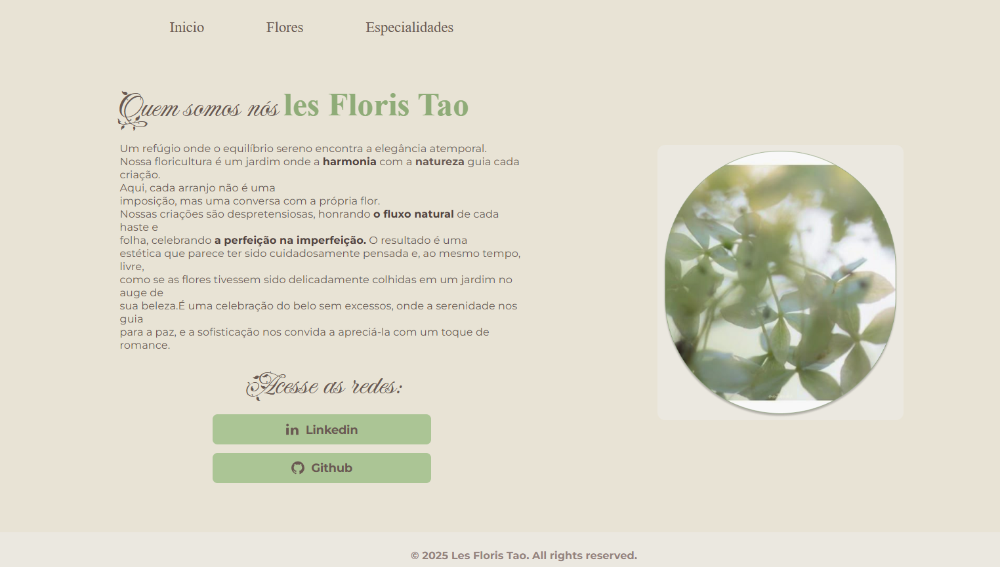

# le Floris Tao

le Floris Tao é meu primeiro projeto de desenvolvimento web, um site para a minha floricultura. 
O projeto foi construído do zero, utilizando as habilidades que adquiri nos cursos de **HTML e CSS da Alura**



## 💻 Tecnologias Utilizadas

* `HTML5`: A estrutura semântica da página, incluindo seções para o catálogo de produtos e informações de contato.
* `CSS3`: A estilização completa da interface, com foco na paleta de cores, tipografia e no layout visual da floricultura.

## ✨ Funcionalidades

* Uma página inicial apresentando a floricultura.
* Catálogo de produtos (buquês, arranjos, etc.).
* Informações de contato.
* Layout responsivo para se adaptar a diferentes dispositivos (desktop, tablet, mobile).

## 🚀 Como Visualizar

Você pode acessar o site diretamente através do [**le Floris Tao**](URL_DO_SEU_SITE_NO_GITHUB_PAGES).

Se preferir, pode clonar o repositório para a sua máquina:

1.  Clone o repositório:
    ```bash
    git clone URL_DO_SEU_REPOSITORIO
    ```
2.  Abra o arquivo `index.html` no seu navegador de preferência.

## ✉️ Contato

Se você gostou do projeto ou tem alguma sugestão, sinta-se à vontade para entrar em contato comigo!

**GitHub:** https://github.com/ValentinaSousa \
**LinkedIn:** https://www.linkedin.com/in/valentina-sousa-318636376/

# Autores
|[<br><sub>Valentina Sousa</sub>](https://github.com/ValentinaSousa)

